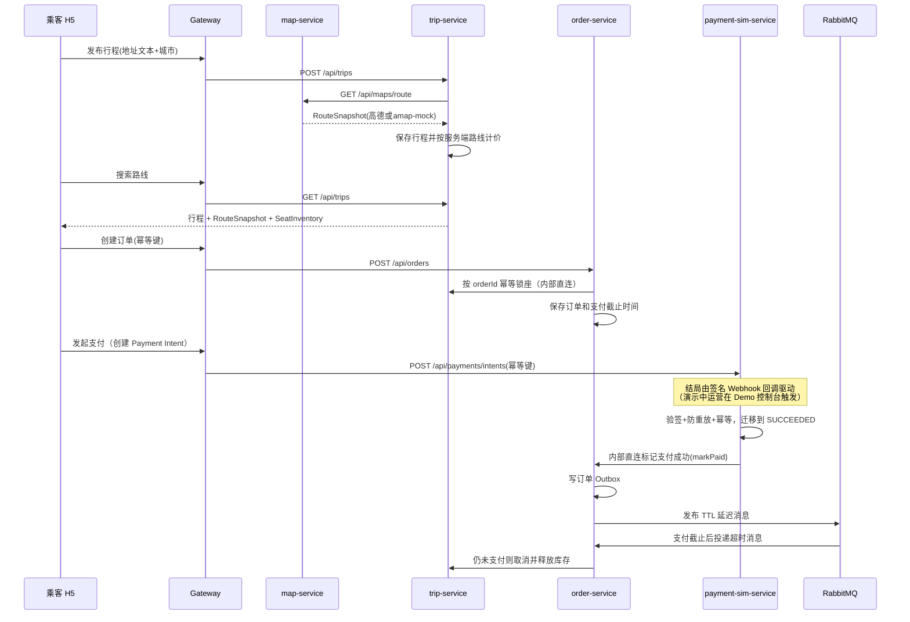

# 架构设计

## 技术基线

- JDK 21
- Spring Boot 3.5.15
- Spring Cloud 2025.0.3
- Spring Cloud Alibaba 2025.0.0.0
- React + TypeScript + Vite
- Ant Design / ProComponents / Ant Design Mobile
- MySQL、Redis、RabbitMQ、MongoDB、MinIO、Nacos

## 模块

```text
gateway-service       统一入口、路由、限流、鉴权入口
auth-service          手机号登录、Token、角色
user-service          用户资料、角色、账号状态
driver-service        司机资质、车辆、审核状态
trip-service          发车、路线快照、搜索、库存视图
order-service         订座、状态机、超时取消
payment-sim-service   模拟支付隔离层
map-service           高德地图适配层和路线快照
file-service          MinIO 文件对象和授权访问
ai-service            OCR Mock 和未来 OCR 供应商适配
admin-service         运营后台聚合接口
audit-service         审计日志和关键事件归档
common                领域模型、状态机、事件类型
```

## 后端基础框架复用

当前项目已从 `llfzzz/RTT` 的 Backend Foundation / ELAdmin 基础层中抽取适合本项目的通用框架形态，并按 Spring Boot 3.5 微服务结构落到 `backend/common`：

- `BackendFoundationAutoConfiguration` 通过 Boot 3 `AutoConfiguration.imports` 自动接入 MVC 微服务，不要求每个服务手工扫描 common 包。
- `TraceIdFilter` 统一接收或生成 `X-Trace-Id`，写入响应头和 MDC，为后续日志、审计和链路追踪留入口。
- `GlobalApiExceptionHandler` 统一输出 `status`、`errorCode`、`message`、`traceId`、`timestamp`、`details`，作为后续企业级错误码响应基线。
- `BusinessException` 为服务层提供显式业务错误入口，避免 Controller 直接拼装错误响应。
- `JwtTokenService` 提供 HS512 JWT 签发和解析，统一 `sub=userId`、`roles`、`jti`、`iat`、`exp` claims。
- `SecurityPrincipal` 统一表达 `userId` 和 `RIDER/DRIVER/OPERATOR/ADMIN` 角色，用于 Gateway RBAC 与下游透传。
- `WebFluxApiErrorWriter` 让 Gateway 的 `401/403/429` 与 MVC 服务保持同一 `ApiError` 响应结构。
- `FixedWindowRateLimiter` 抽象对齐 RTT `@Limit(period,count,key,type)` 语义，当前默认内存实现，配置 `security.rate-limit.backend=redis` 时切到 Redis Lua 固定窗口计数。

没有直接整体引入 RTT 的 ELAdmin 单体后台用户、菜单、JPA Repository 和旧包名模块；这些能力和当前 Spring Cloud 微服务边界、现有角色模型、Boot 3.5 版本线不完全匹配。Slice 3 只复用了 RTT 的 JWT、认证失败响应、限流和操作日志设计思路，并改成 Boot 3 / WebFlux / 微服务适配版本；通用能力后续同步沉淀到 RTT 的 Boot 3 foundation starter。

## Gateway 安全策略

- `/api/auth/**`、`/actuator/health`、`/actuator/info` 允许匿名访问。
- 其他 `/api/**` 必须通过 Gateway Bearer JWT 校验。
- `/api/admin/**`、`/api/audits/**`、`/api/orders/admin/**` 要求 `OPERATOR` 或 `ADMIN`。
- Gateway 会移除客户端伪造的 `X-User-Id`、`X-User-Roles`、`X-Trace-Id` 和 `Authorization` 转发头，再写入服务端验证后的 principal 与 traceId。
- 默认限流为 `/api/auth/**` 每 IP 每 60 秒 20 次，其他 `/api/**` 每 userId 每 60 秒 120 次。
- 本地 Vite H5/Admin 调 Gateway 已配置 CORS；`OPTIONS` 预检请求不要求 Bearer token。

## 关键链路



## 数据一致性

- 订单创建使用 `rider_id + idempotency_key` 防重复。
- 行程库存由 Trip 服务用数据库行锁和 `orderId` seat lock 表保证幂等锁座/释放。
- 订单支付成功和超时取消必须先读订单当前状态，不能直接覆盖状态。
- 当前 `0.5.0-SNAPSHOT` 订单创建在本地事务中写 `order_outbox_events`，Outbox publisher 将支付超时事件投递到 RabbitMQ TTL + DLX 延迟队列；order-service 定时扫描保留为兜底对账。
- Trip 发布行程时调用 Map 服务获取 `RouteSnapshot`，距离、时长和价格都以服务端结果为准，旧客户端传入的距离和时长只做兼容接收、不参与计价。
- Map 服务将高德或 Mock 路线结果写入 `route_snapshots`，保存脱敏后的供应商响应快照，避免只依赖前端临时数据。
- 文件对象由 file-service 统一生成 MinIO object key 和短时授权 URL；owner/operator/admin 以外不能获取私有下载 URL。
- 审计日志由 audit-service 写入 MongoDB `audit_logs`，业务服务通过 best-effort Feign 调用写关键操作审计。

## 缓存与限流（S50，两套 Redis 角色）

- **State Redis**（既有实例）：安全/正确性 TTL 状态（短信码、refresh token、支付 nonce、司机在线位置）+ 分布式限流窗口计数；`noeviction`。
- **Cache Redis**（新增、可选、可丢弃实例，`allkeys-lfu`、关持久化，`docker-compose.cache.yml`）：只放**派生可重建**数据——地图路线读缓存（`cache:map:route:v1:<sha256>`，版本化 String，TTL=base+抖动且被 MySQL 快照剩余新鲜度封顶）与缓存填充租约。缓存失效一律降级为 miss，走 MySQL/Provider 权威路径，绝不掩盖凭据/城市/坐标/Provider 错误、绝不污染权威状态。
- **地图路线缓存查找序**：校验 → Redis 新鲜 → MySQL 新鲜（回填 Redis）→ Provider（走既有熔断）→ 存 MySQL → 回填 Redis。进程内 single-flight + 跨实例**缓存填充租约**（`SET NX PX` + Lua owner compare-and-delete，仅用于去重 Provider 调用，绝不用于业务正确性）。
- **网关限流**：`security.rate-limit.backend=redis` 时用反应式 Lua 打到 State Redis，跨网关实例共享配额、`Retry-After` 取自窗口剩余、绝不阻塞 Netty 事件循环；Redis 故障进入有度量的降级（本地应急限流或敏感桶 fail-closed）。`backend=memory` 为单机内存实现。MVC 服务（如短信/nonce 每手机号限流）仍用 `FixedWindowRateLimiter` 阻塞实现。

## 可插拔适配

- 高德地图通过 `map-service` 统一封装；配置 `AMAP_API_KEY` 时调用高德 Web 服务地理编码和路径规划 2.0，未配置时明确返回 `amap-mock` fallback，并保存供应商响应快照。
- OCR 首期用 `MockOcrPolicy`，未来替换为外部 OCR Provider。
- 支付首期为 `payment-sim-service`，真实支付必须新建适配器并隔离回调签名校验。
