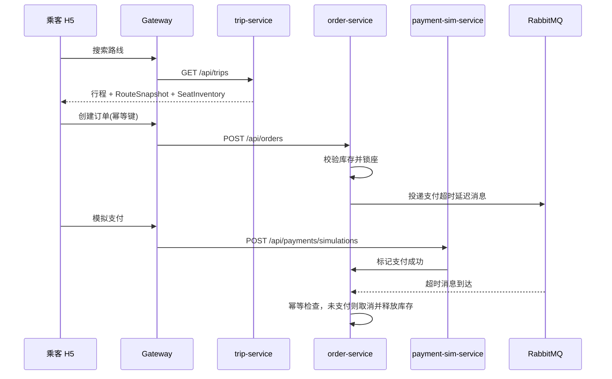

# 架构设计

## 技术基线

- JDK 21
- Spring Boot 3.5.15
- Spring Cloud 2025.0.3
- Spring Cloud Alibaba 2025.0.0.0
- React + TypeScript + Vite
- Ant Design / ProComponents / Ant Design Mobile
- MySQL、Redis、RabbitMQ、MongoDB、MinIO、Nacos

## 模块

```text
gateway-service       统一入口、路由、限流、鉴权入口
auth-service          手机号登录、Token、角色
user-service          用户资料、角色、账号状态
driver-service        司机资质、车辆、审核状态
trip-service          发车、路线快照、搜索、库存视图
order-service         订座、状态机、超时取消
payment-sim-service   模拟支付隔离层
map-service           高德地图适配层和路线快照
file-service          MinIO 文件对象和授权访问
ai-service            OCR Mock 和未来 OCR 供应商适配
admin-service         运营后台聚合接口
audit-service         审计日志和关键事件归档
common                领域模型、状态机、事件类型
```

## 关键链路



## 数据一致性

- 订单创建使用 `rider_id + idempotency_key` 防重复。
- 行程库存使用版本号或数据库行锁，后续落库时实现乐观锁。
- 订单事件使用 Outbox 表，消费者通过 `event_id` 幂等。
- 支付超时消息必须先读订单当前状态，不能直接取消。

## 可插拔适配

- 高德地图通过 `map-service` 统一封装，保存供应商响应快照。
- OCR 首期用 `MockOcrPolicy`，未来替换为外部 OCR Provider。
- 支付首期为 `payment-sim-service`，真实支付必须新建适配器并隔离回调签名校验。
